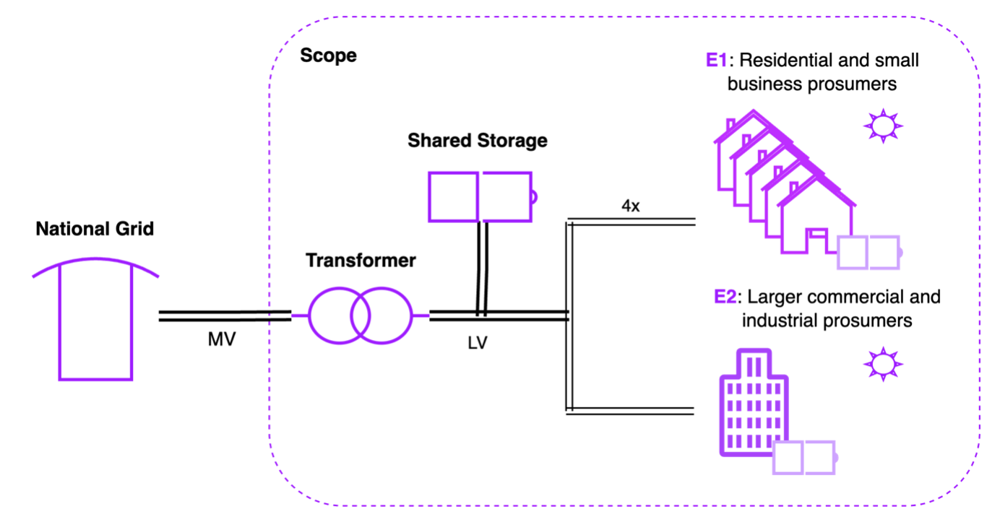

# 📊 **Energy Community Model using Calliope**

> **"Optimizing grid flexibility, renewable energy integration, and cost efficiency for energy communities in urban areas."**

---

## 📚 **Project Overview**

This repository contains the **Energy Community Model** developed as part of my **master's thesis** at **Delft University of Technology (TU Delft)** in collaboration with **Accenture**. The model employs **Calliope**, an open-source energy system modeling framework, to optimize energy distribution, reduce costs, and integrate renewable energy in urban energy systems in the Netherlands.

The thesis addresses challenges related to **grid congestion**, **energy affordability**, and **sustainability** while exploring the potential of **energy communities** to improve the use of existing infrastructure.

---

## 🎯 **Objectives**

- **Optimize Grid Flexibility:** Mitigate grid congestion through efficient energy distribution.
- **Cost Efficiency:** Minimize energy costs for participants in energy communities.
- **Renewable Energy Integration:** Maximize the deployment and use of PV systems and batteries.
- **Scalability:** Adapt to both neighborhoods and industrial districts.
- **Scenario Analysis:** Explore trade-offs between affordability, sustainability, and grid security.

---

## 🛠️ **Model Description**

### **Core Components**
- **Technologies:** Solar PV, distributed and central batteries, transformers, and grid connections.
- **Actors:** DSOs, aggregators, municipalities, and households.
- **Scenarios:** Sensitivity scenarios address transformer sizes, PV capacity, energy pricing models, and battery costs.

### **Optimization Framework**
- The model optimizes grid flexibility, operational costs, and CO₂ emissions via **multi-objective linear programming (MO-LP)**.
- Built using **2023 data**, focusing on urban energy systems.

### **Software Tools**
- **Calliope:** For energy system optimization.
- **Python:** For preprocessing, analysis, and visualization.
- **Jupyter Dashboards:** For interactive result exploration.



---

## 📂 **Repository Structure**

```plaintext
📄    Dashboard.ipynb       # Interactive dashboard for general plots
📁 /data_sources
    ├── demand_profiles.csv    # Energy demand profiles
    ├── price_day-ahead_2023.csv # Energy price data (day-ahead)
    ├── transformer_congestion_factor.csv # Transformer strain data
📁 /Experiments
    ├── General_plots.ipynb     # Generate plots for visualization
    📂 pareto_fronts            # Results from Pareto front experiments
    📂 perspectives             # Experiments on stakeholder perspectives
    📂 sensitivity              # Sensitivity analysis results
📁 /model_config
    ├── locations.yaml         # Node and actor spatial data
    ├── techs.yaml             # Technology configurations
    ├── templates.yaml         # Standardised templates for tech paramters
    ├── transmissions.yaml     # Electricity cables between locations

📄 scenarios.yaml              # Scenario overrides for experiments
📄 model.yaml                  # Core model definition
📄 README.md                   # Project documentation
```

---

## 🚀 **Getting Started**

### **1. Prerequisites**

Ensure the following are installed:
- **Python 3.8+**
- **Calliope 0.6+**
- Python libraries: `pandas`, `xarray`, `numpy`, `plotly`, `matplotlib`

Install dependencies with:
```bash
pip install -r requirements.txt
```

---

### **2. Running the Model**

Run simulations by using the **files provided in the repository**. For example:

1. Open the **`Dashboard.ipynb`** to explore general plots and results interactively.
2. For sensitivity analysis or specific scenario runs, modify and execute files within the `/Experiments` folder:
   - Use **`pareto_fronts`** for trade-offs between objectives.
   - Use **`perspectives`** for stakeholder-focused simulations.
   - Use **`sensitivity`** for exploring parameter variations.

Results are automatically saved in the appropriate `/results/` subfolders.

---

### **3. Visualizing Results**

Use the interactive dashboard or Python notebooks for detailed analysis:
- **Dashboard:** `Dashboard.ipynb`
- **Pareto Fronts:** Visualize objective trade-offs in `/Experiments/pareto_fronts/`.
- **Perspectives:** Stakeholder analyses are in `/Experiments/perspectives/`.

For customized analysis:
- Modify `scenarios.yaml` and run the model to generate tailored results.

---

## 📊 **Scenario Analysis**

### **Sensitivity Scenarios:**
- Transformer Sizes: **undersized**, **oversized**
- PV Capacity: **low**, **high**
- Energy Pricing: **fixed**, **day-ahead**
- Electrification Levels: **low**, **high**
- Battery Costs: **medium**, **low**

### **Objective Trade-offs:**
- **Affordability:** Cost optimization.
- **Sustainability:** Maximizing renewable energy use.
- **Grid Security:** Minimizing transformer congestion.

---

## 🚦 **Limitations**

1. **2023-Specific Data:** Results are calibrated to 2023 scenarios and may not generalize to other years.
2. **No Low-Voltage Details:** The model abstracts away localized voltage or cable constraints.
3. **Market Price Proxy:** Transformer congestion is approximated using day-ahead market prices.

---

## 🤝 **Contributing**

Contributions are welcome! Please:
1. Fork the repository.
2. Create a new branch.
3. Submit a pull request with your proposed changes.

---

## 📬 **Contact**

For questions or suggestions, please contact:

- **Tom de Bruin**  
- **TU Delft | Accenture**  
- [LinkedIn](https://www.linkedin.com/in/tom-antonie-de-bruin)
